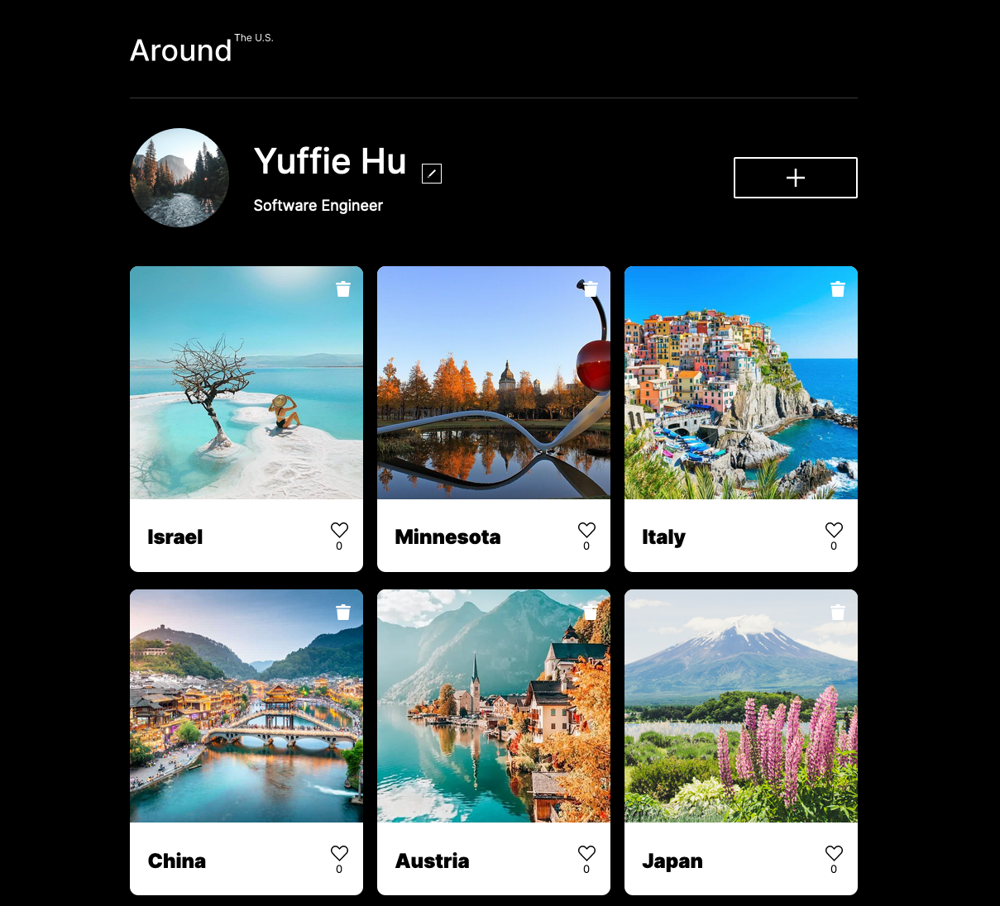

# Project 4: Around The U.S.

An Instagram-like app that displays user's pictures and places, with functionality to like, delete, and custimize.

## Features of the Web App

1. Object Oriented Programming with loose-coupling relationships between classes to dynamically generate components
2. Form Validation
3. Dynamically generate cards of places through the add button
4. Dynamically delete cards through interactive trash button
5. Dynamically change author name and title through edit button

## Technologies and Standards Used

- HTML
- CSS
- JavaScript
- Object Oriented Programming
- BEM file structure
- Webpack

- JavaScript: frontend interactivity and functionality

- Node.js is an open-source, cross-platform runtime environment that allows developers to create all kinds of server-side tools and applications in JavaScript.
- Node. js is primarily used for non-blocking, event-driven servers, due to its single-threaded nature.
- It's used for traditional web sites and back-end API services.

- Webpack is a module bundler. Its main purpose is to bundle JavaScript files for usage in a browser, yet it is also capable of transforming, bundling, or packaging just about any resource or asset.

## Design

**Figma**

- [Link to the project in Figma](https://www.figma.com/file/SurN1jaeEQIhuZEDMhmWWf/Sprint-4-Around-The-U.S.-desktop-mobile?node-id=0%3A1)

## Live Demo

Enjoy the live demo [here](https://yuff1006.github.io/Around_the_US/).
